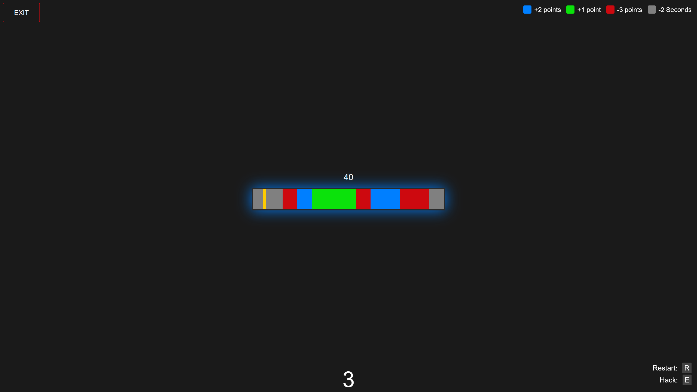

  

🎮 MiniGamer – Archived Web Project

MiniGamer was a browser-based school project that recreated iconic minigames from well-known video games using JavaScript and PHP. The site featured playable clones of specific gameplay mechanics, allowing users to experience them without launching full games.
🧩 Included Minigames:

    🔐 Lockpicking from:

        Kingdom Come: Deliverance

        Mafia

        Bully

    🧠 Hacking puzzles inspired by:

        Cyberpunk 2077

        BioShock

        Agents of Mayhem

🛠️ Features:

    Real-time interactive logic using vanilla JavaScript

    Backend functionality in PHP

    Online leaderboards for score tracking

🎯 Purpose

The project was created as a technical and creative exercise in replicating well-known game mechanics using web technologies.
💻 Technologies Used:

    JavaScript, HTML, CSS

    PHP for backend handling and leaderboard management

    MySQL for storing high scores

❌ Project Status

The website was active until 2025. It is now offline, but this repository serves as a code archive and a portfolio reference.

   <em>Shared lockpicking UI design</em> 
 
   <em>Lockpicking inspired by Mafia</em> 
 
   <em>Lockpicking from Bully</em> 
 
   <em>Kingdom Come: Deliverance lockpicking system</em> 
 
   <em>Various hacking puzzles overview</em> 
 
   <em>Hacking puzzle from Cyberpunk 2077</em> 
 
   <em>BioShock-style hacking interface</em> 
 
   <em>Hacking system inspired by Agents of Mayhem</em> 

